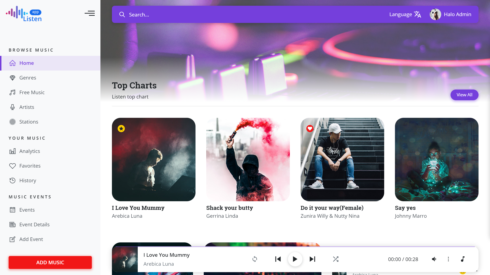

<!-- Web project -->
<!--
*** I'm using markdown "reference style" links for readability.
*** Reference links are enclosed in brackets [ ] instead of parentheses ( ).
*** See the bottom of this document for the declaration of the reference variables
*** for contributors-url, forks-url, etc. This is an optional, concise syntax you may use.
*** https://www.markdownguide.org/basic-syntax/#reference-style-links
-->
<!-- [![Contributors][contributors-shield]][contributors-url]
[![Forks][forks-shield]][forks-url]
[![Stargazers][stars-shield]][stars-url]
[![Issues][issues-shield]][issues-url]
[![MIT License][license-shield]][license-url]
[![LinkedIn][linkedin-shield]][linkedin-url]-->


<!-- PROJECT flask -->
<br />
<p align="center">
  <a href="https://github.com/QuentinDesse/projetflask">
    
  </a>

  <h3 align="center">Web Project</h3>

  <p align="center">
  The repo of the project web project of LP RGI
    <br />
    <a href="https://www.delahayeyourself.info/projects/chinook/"><strong>Explore the docs »</strong></a>
    <br />
    <br />
  </p>
</p>


<!-- TABLE OF CONTENTS -->
## Table of Contents

* [About the Project](#about-the-project)
  * [Built With](#built-with)
* [Getting Started](#getting-started)
  * [Prerequisites macOS/linux](#prerequisites-macoslinux)
  * [Installation & Compilation](#installation--compilation)
* [Usage](#usage)
* [Improvement](#improvement)
* [Contact](#contact)


<!-- ABOUT THE PROJECT -->
## About The Project

The goal of this project is to make you practice all the concepts seen in class. You need to create a website allowing to expose the contents of a database via a graphical interface.

Here are the minimum functionalities expected for the project, any addition will obviously be enhanced:

- Home page displays artists, albums and genres available on the site
- Artist consultation page which also allows you to see all of the said artist's albums
- Consultation page of an album displays the songs of this one
- Genre consultation page (listing songs of the genre)
- Customer consultation page
- Customer consultation page listing in particular the customer's orders
- Order consultation page
- Employee consultation page
- Employee consultation page and listing of his clients and his manager
- Addition page of an order (linked to an employee, a customer and at least one title)

------------------------------------------------
<table>
    <thead>
        <tr>
            <th align="center">Studens of the project</th>
            <th align="center">Teatchers</th>
            <th align="center">High school Proméo</th>
            <th align="center">Licence Pro</th>
        </tr>
    </thead>
    <tbody>
        <tr>
            <td align="center">Desse Quentin</td>
            <td align="center">Delahaye Samy </td>
            <td align="center"> 240 Avenue Marcel Dassault, 60002 Beauvais</td>
            <td align="center">Réseaux et Genie informatique</td>
        </tr>
        <tr>
            <td align="center">Radde Théo</td>
           <td align="center">Delahaye Samy </td>
            <td align="center"> 240 Avenue Marcel Dassault, 60002 Beauvais</td>
            <td align="center">Réseaux et Genie informatique</td>
        </tr>
        <tr>
            <td align="center">Regnier Louis</td>
            <td align="center">Delahaye Samy </td>
            <td align="center"> 240 Avenue Marcel Dassault, 60002 Beauvais</td>
            <td align="center">Réseaux et Genie informatique</td>
        </tr>
    </tbody>
</table>

### Built With

* [HTML/CSS](https://developer.mozilla.org/fr/docs/Learn/Getting_started_with_the_web/CSS_basics)
* [PHP Storm](https://www.jetbrains.com/fr-fr/phpstorm/)
* [Flask](https://flask.palletsprojects.com/en/2.0.x/)
* [Pawee](http://docs.peewee-orm.com/en/latest/)
* [WtForm](https://wtforms.readthedocs.io/en/2.3.x/)


<!-- GETTING STARTED -->
## Getting Started
### Prerequisites macOS/linux

* [PhpStorm] Or other IDE with C++ compilator
This is an example of how to list things you need to use the software and how to install them
* [Flask] Install Flask
* Create an environment
```
$ mkdir myproject
$ cd myproject
$ python3 -m venv venv
```
* Activate the environment
```
$ . venv/bin/activate
```
* Install Flask
```
$ pip install Flask 
```
* Install Pewee 

```
pip install peewee
```

### Installation & Compilation
 
1. Clone the repo
```sh
git clone https://github.com/github_username/Project-Name.git
```
2. Activate Flask
In the dossier 'ProjetFlask', open a terminal, you can run with :
```
Flask run 
```
3. Graphic Interface acces : 
In web browser, Running on : 
``` 
http://127.0.0.1:5000/
```


<!-- USAGE EXAMPLES 
## Usage
<p align="center">
  <a href="#">
    
    <a>
  </p> -->


<!-- Improvement -->
## Improvement

Some areas for improvement of the project :

1. An API that allows you to display the information of consultations 1 to 10 above via a REST API.
2. A customer connection interface to place an order.
3. A connection interface used to view orders.

<!-- CONTACT -->
## Contact
* Student n°1 : [QuentinDesse GIT](https://github.com/QuentinDesse)
* Student n°2 : [ThéoRadde GIT](https://github.com/theoradde)
* Student n°2 : [LouisRegnier linkedin](https://www.linkedin.com/in/louis-regnier-3bb48a121/)


<!-- MARKDOWN LINKS & IMAGES -->
<!-- https://www.markdownguide.org/basic-syntax/#reference-style-links -->
[contributors-shield]: https://img.shields.io/github/contributors/othneildrew/Best-README-Template.svg?style=flat-square
[contributors-url]: https://github.com/othneildrew/Best-README-Template/graphs/contributors
[forks-shield]: https://img.shields.io/github/forks/othneildrew/Best-README-Template.svg?style=flat-square
[forks-url]: https://github.com/othneildrew/Best-README-Template/network/members
[stars-shield]: https://img.shields.io/github/stars/othneildrew/Best-README-Template.svg?style=flat-square
[stars-url]: https://github.com/othneildrew/Best-README-Template/stargazers
[issues-shield]: https://img.shields.io/github/issues/othneildrew/Best-README-Template.svg?style=flat-square
[issues-url]: https://github.com/othneildrew/Best-README-Template/issues
[license-shield]: https://img.shields.io/github/license/othneildrew/Best-README-Template.svg?style=flat-square
[license-url]: https://github.com/othneildrew/Best-README-Template/blob/master/LICENSE.txt
[linkedin-shield]: https://img.shields.io/badge/-LinkedIn-black.svg?style=flat-square&logo=linkedin&colorB=555
[linkedin-url]: https://linkedin.com/in/othneildrew
[product-screenshot]: images/screenshot.png
